# Class Diagram v3 (Simplified)

## สรุปการเปลี่ยนจาก v2
- `AccessPrincipal` ลด: ตัด `permissions[]` และ `hasPermission()` (authz rule = hasActiveSubscription + ownership เท่านั้น)
- เพิ่ม `UserService` แยก orchestration ออกจาก `User` entity
- `SubscriptionService` เพิ่ม `cancel()`, `checkExpirations()`
- `Content` ตัด abstract `requestAccess()` ออก — ย้ายการตรวจสิทธิ์ไปทำใน `ContentService`

```mermaid
---
config:
  layout: elk
---
classDiagram
  direction TB

  class User {
    <<Entity>>
    +String userId
    +String email
    -String passwordHash
    +String displayName
    +String avatarUrl
    +String language
  }

  class UserService {
    <<Service>>
    +register(email String, pass String, displayName String) String
    +changeEmail(principal AccessPrincipal, newEmail String) boolean
    +changePassword(principal AccessPrincipal, oldPass String, newPass String) boolean
    +updateProfile(principal AccessPrincipal, displayName String, avatarUrl String) boolean
    +setLanguage(principal AccessPrincipal, language String) boolean
    +getUserById(userId String) User
  }

  class AccessPrincipal {
    <<Immutable>>
    +String userId
    +boolean hasActiveSubscription
    +Date expiresAt
    +isExpired() boolean
  }

  class AuthManager {
    <<Service>>
    +login(email String, pass String) String
    +refresh(refreshToken String) String
    +verify(accessToken String) AccessPrincipal
  }

  class Subscription {
    <<Entity>>
    +String subscriptionId
    +String userId
    +String billingCycle
    +Float price
    +SubscriptionStatus status
    +Date startDate
    +Date endDate
    +activate() boolean
    +cancel() boolean
    +expire() boolean
  }

  class SubscriptionService {
    <<Service>>
    +subscribe(principal AccessPrincipal, billingCycle String) String
    +cancel(principal AccessPrincipal) boolean
    +renew(principal AccessPrincipal) String
    +onPaymentSuccess(externalTransactionId String) boolean
    +checkExpirations() void
    +getSubscriptionByUserId(userId String) Subscription
  }

  class Payment {
    <<Entity>>
    +String paymentId
    +String subscriptionId
    +String externalTransactionId
    +PaymentStatus status
    +Float amount
    +String currency
    +Date paidAt
    +Date deletedAt
  }

  class PaymentGateway {
    <<External Integration>>
    +createPaymentIntent(amount Float, currency String) String
    +handleWebhook(payload Object) boolean
    +refund(paymentId String) boolean
  }

  class Content {
    <<Abstract>>
    +String contentId
    +String creatorId
    +String title
    +String cdnUrl
    +generateCdnUrl()* String
  }

  class Video {
    +String resolution
    +int duration
    +String codec
  }

  class Music {
    +String artist
    +int bitrate
    +String genre
  }

  class ContentService {
    <<Service>>
    +createContent(principal AccessPrincipal, meta Object) boolean
    +updateContent(principal AccessPrincipal, contentId String, meta Object) boolean
    +deleteContent(principal AccessPrincipal, contentId String) boolean
    +uploadContent(principal AccessPrincipal, file Object) String
    +getContentById(contentId String) Content
    +getAllContents() List~Content~
    +getContentsByCreatorId(creatorId String) List~Content~
    +getContentsByType(type String) List~Content~
  }

  class WatchHistory {
    <<Entity>>
    +String historyId
    +String userId
    +String contentId
    +Date watchedAt
    +int lastPosition
  }

  class PlaybackService {
    <<Service>>
    +recordWatchHistory(principal AccessPrincipal, contentId String, position int) boolean
    +getWatchHistoryByUserId(userId String) List~WatchHistory~
    +getResumePosition(principal AccessPrincipal, contentId String) int
  }

  class SubscriptionStatus {
    <<Enumeration>>
    PENDING
    ACTIVE
    EXPIRED
    CANCELLED
  }

  class PaymentStatus {
    <<Enumeration>>
    PENDING
    COMPLETED
    FAILED
    REFUNDED
  }

  AuthManager ..> AccessPrincipal : produces
  UserService ..> User : manages
  UserService ..> AccessPrincipal : consumes
  User "1" -- "0..1" Subscription : subscribes
  Subscription --> SubscriptionStatus : tracks
  Subscription "1" o-- "*" Payment : aggregates
  Payment --> PaymentStatus : tracks
  SubscriptionService ..> Subscription : manages
  SubscriptionService ..> PaymentGateway : initiates
  SubscriptionService ..> AccessPrincipal : consumes
  PaymentGateway ..> Payment : creates
  Content <|-- Video : extends
  Content <|-- Music : extends
  ContentService ..> Content : manages
  ContentService ..> AccessPrincipal : consumes
  User "1" -- "*" Content : creates
  WatchHistory "*" --> "1" User : belongs to
  WatchHistory "*" --> "1" Content : records
  PlaybackService ..> WatchHistory : manages
  PlaybackService ..> AccessPrincipal : consumes

  note for AccessPrincipal "Snapshot จาก JWT claims — ไม่มี permissions list เพราะ rule = hasActiveSubscription + ownership เทียบ userId ใน service เอง"
  note for AuthManager "login: verify password + เช็ค subscription → sign JWT / verify: decode + check signature + exp → สร้าง AccessPrincipal / refresh: issue access token ใหม่ ด้วย subscription snapshot ปัจจุบัน / logout ฝั่ง client (ทิ้ง token)"
  note for Subscription "Plan เดียวในระบบ billingCycle กับ price ฝังในนี้ / activate: PENDING→ACTIVE พร้อมตั้ง endDate / expire: ACTIVE→EXPIRED เมื่อเลย endDate"
  note for SubscriptionService "subscribe ป้องกันสมัครซ้อน / onPaymentSuccess ถูกเรียกจาก webhook / checkExpirations รันเป็น cron"
  note for PaymentGateway "externalTransactionId UNIQUE กัน webhook ซ้ำ (NFR Reliability) / handleWebhook ตรวจ HMAC ก่อน"
  note for ContentService "uploadContent/createContent/updateContent/deleteContent ต้อง hasActiveSubscription / update+delete เช็ค principal.userId == content.creatorId"
  note for PlaybackService "recordWatchHistory upsert ตาม (userId, contentId) เก็บ lastPosition / getResumePosition คืนจุดเล่นต่อ (FR 5.4)"
```

