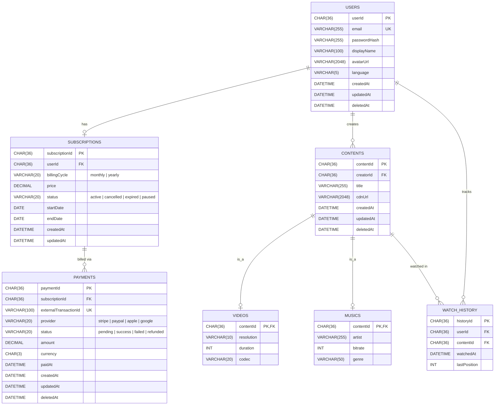

# ER Diagram

## Tables Overview

- **users** — จัดเก็บข้อมูลผู้ใช้ รวมถึงข้อมูลโปรไฟล์และข้อมูลสำหรับ authentication เช่น email และ passwordHash รวมถึงค่าการตั้งค่า เช่น language
- **subscriptions** — เก็บข้อมูลการสมัครสมาชิก โดยกำหนดให้ผู้ใช้หนึ่งคนมีได้สูงสุดหนึ่ง active subscription ในช่วงเวลาเดียวกัน (enforced ผ่าน constraint)
- **payments** — บันทึกประวัติการชำระเงินของแต่ละ subscription โดยใช้ soft delete (`deletedAt`) เพื่อรองรับการ audit และการกู้คืนข้อมูล
- **contents** — ตารางหลักสำหรับเก็บข้อมูลเนื้อหา โดยใช้แนวคิด class table inheritance เพื่อแยก subtype ออกเป็น videos และ musics
- **videos**, **musics** — ตารางย่อย (subtype) สำหรับเก็บรายละเอียดเฉพาะของ content แต่ละประเภท โดยอ้างอิงกับ contents
- **watch_history** — เก็บประวัติการรับชมของผู้ใช้ โดยใช้ unique constraint (`userId`, `contentId`) เพื่อรองรับการอัปเดตตำแหน่งการรับชมล่าสุด (resume position)

## Key Constraints & Indexes

| ตาราง           | Constraint / Index                                                     | เหตุผล                                                                            |
| --------------- | ---------------------------------------------------------------------- | --------------------------------------------------------------------------------- |
| users           | `UNIQUE(email)`                                                        | ป้องกันการสมัครซ้ำของผู้ใช้ (FR 1.1)                                              |
| subscriptions   | `UNIQUE(userId) WHERE status IN ('active','pending')`                  | ป้องกันการมี subscription ที่ active ซ้อนกัน (FR 3.1)                             |
| subscriptions   | `INDEX(status, endDate)`                                               | รองรับการตรวจสอบสถานะหมดอายุโดย background job เช่น `checkExpirations()` (FR 3.3) |
| payments        | `UNIQUE(externalTransactionId)`                                        | ป้องกันการประมวลผล webhook ซ้ำ (Reliability)                                      |
| payments        | `INDEX(subscriptionId, paidAt)`                                        | เพิ่มประสิทธิภาพในการดึงประวัติการชำระเงิน                                        |
| contents        | `INDEX(creatorId)`                                                     | รองรับการ query เนื้อหาที่สร้างโดยผู้ใช้ (เช่น "My Contents")                     |
| videos / musics | `PRIMARY KEY (contentId)` + `FOREIGN KEY → contents ON DELETE CASCADE` | รับประกันความสัมพันธ์แบบ 1:1 และลบข้อมูลตาม parent                                |
| watch_history   | `UNIQUE(userId, contentId)`                                            | รองรับการอัปเดตตำแหน่งการรับชมล่าสุด (FR 5.4)                                     |
| watch_history   | `INDEX(userId, watchedAt DESC)`                                        | เพิ่มประสิทธิภาพในการแสดงประวัติการรับชมย้อนหลัง                                  |

## Mapping FR → Tables

| FR                             | Tables ที่เกี่ยวข้อง                          |
| ------------------------------ | --------------------------------------------- |
| FR 1.1 Registration            | users                                         |
| FR 1.2 Profile Management      | users                                         |
| FR 2.x Authentication          | users (ใช้ passwordHash) — ใช้ stateless JWT  |
| FR 3.1 Subscription Management | subscriptions, payments                       |
| FR 3.2 Subscription Validation | subscriptions (ตรวจสอบ status และ endDate)    |
| FR 3.3 Status Tracker          | subscriptions (อัปเดตสถานะผ่าน scheduled job) |
| FR 3.4 Activation Handler      | subscriptions (อัปเดตผ่าน webhook)            |
| FR 4.1 Payment Initiation      | payments                                      |
| FR 4.2 Payment Result          | payments, subscriptions                       |
| FR 5.1 Content Management      | contents, videos, musics                      |
| FR 5.2 Content Display         | contents                                      |
| FR 5.3 Content Delivery        | contents (ตรวจสอบสิทธิ์ผ่าน subscriptions)    |
| FR 5.4 Playback Tracker        | watch_history                                 |
