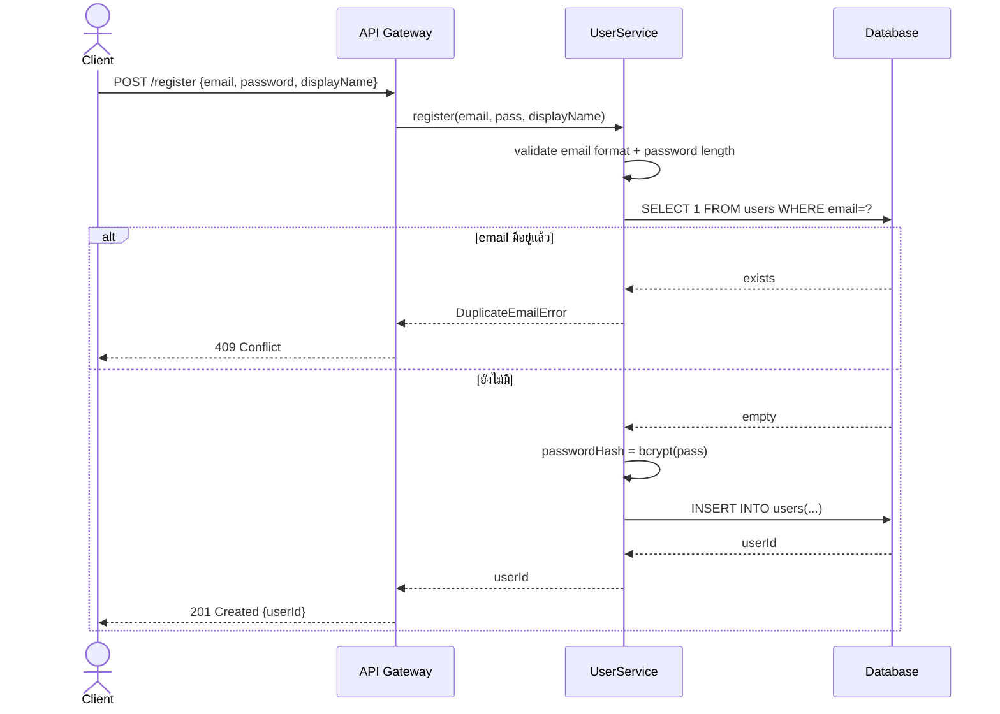
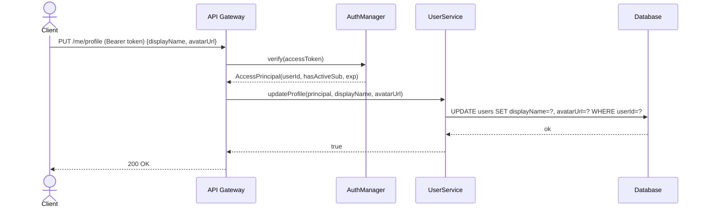
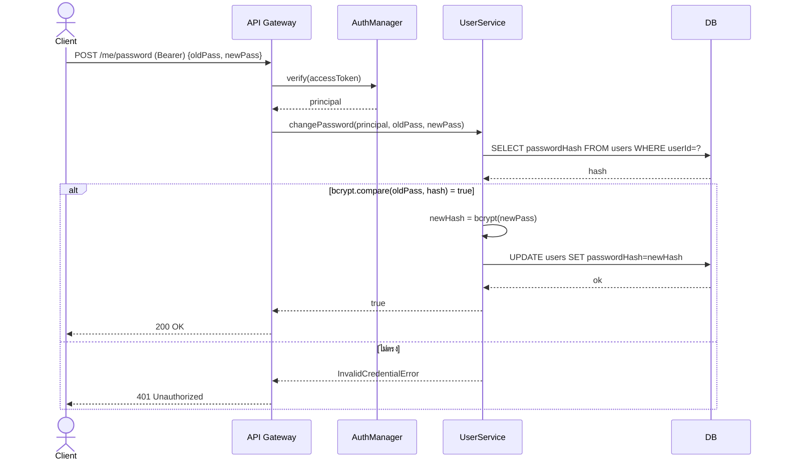
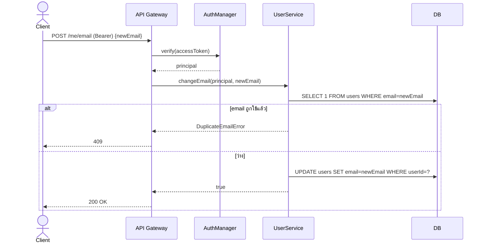

# Sequence 01 — User Flows (FR 1.1, 1.2)

## 1.1 User Registration (FR 1.1)

```mermaid
sequenceDiagram
  actor Client
  participant API as API Gateway
  participant US as UserService
  participant DB as Database

  Client->>API: POST /register {email, password, displayName}
  API->>US: register(email, pass, displayName)
  US->>US: validate email format + password length
  US->>DB: SELECT 1 FROM users WHERE email=?
  alt email มีอยู่แล้ว
    DB-->>US: exists
    US-->>API: DuplicateEmailError
    API-->>Client: 409 Conflict
  else ยังไม่มี
    DB-->>US: empty
    US->>US: passwordHash = bcrypt(pass)
    US->>DB: INSERT INTO users(...)
    DB-->>US: userId
    US-->>API: userId
    API-->>Client: 201 Created {userId}
  end
```

## 1.2 Update Profile (FR 1.2)

```mermaid
sequenceDiagram
  actor Client
  participant API as API Gateway
  participant AM as AuthManager
  participant US as UserService
  participant DB as Database

  Client->>API: PUT /me/profile (Bearer token) {displayName, avatarUrl}
  API->>AM: verify(accessToken)
  AM-->>API: AccessPrincipal(userId, hasActiveSub, exp)
  API->>US: updateProfile(principal, displayName, avatarUrl)
  US->>DB: UPDATE users SET displayName=?, avatarUrl=? WHERE userId=?
  DB-->>US: ok
  US-->>API: true
  API-->>Client: 200 OK
```

## 1.3 Change Password (FR 1.2)

```mermaid
sequenceDiagram
  actor Client
  participant API as API Gateway
  participant AM as AuthManager
  participant US as UserService
  participant DB

  Client->>API: POST /me/password (Bearer) {oldPass, newPass}
  API->>AM: verify(accessToken)
  AM-->>API: principal
  API->>US: changePassword(principal, oldPass, newPass)
  US->>DB: SELECT passwordHash FROM users WHERE userId=?
  DB-->>US: hash
  alt bcrypt.compare(oldPass, hash) = true
    US->>US: newHash = bcrypt(newPass)
    US->>DB: UPDATE users SET passwordHash=newHash
    DB-->>US: ok
    US-->>API: true
    API-->>Client: 200 OK
  else ไม่ตรง
    US-->>API: InvalidCredentialError
    API-->>Client: 401 Unauthorized
  end
```

## 1.4 Change Email (FR 1.2)

```mermaid
sequenceDiagram
  actor Client
  participant API as API Gateway
  participant AM as AuthManager
  participant US as UserService
  participant DB

  Client->>API: POST /me/email (Bearer) {newEmail}
  API->>AM: verify(accessToken)
  AM-->>API: principal
  API->>US: changeEmail(principal, newEmail)
  US->>DB: SELECT 1 FROM users WHERE email=newEmail
  alt email ถูกใช้แล้ว
    US-->>API: DuplicateEmailError
    API-->>Client: 409
  else ว่าง
    US->>DB: UPDATE users SET email=newEmail WHERE userId=?
    US-->>API: true
    API-->>Client: 200 OK
  end
```
