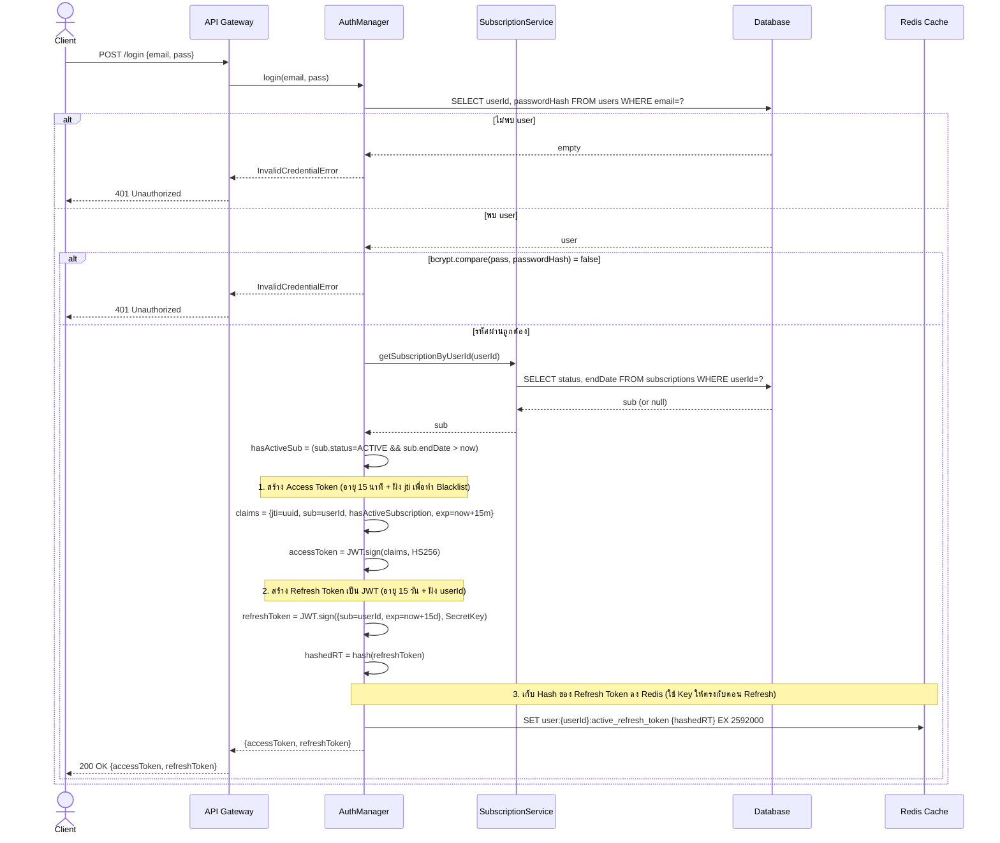
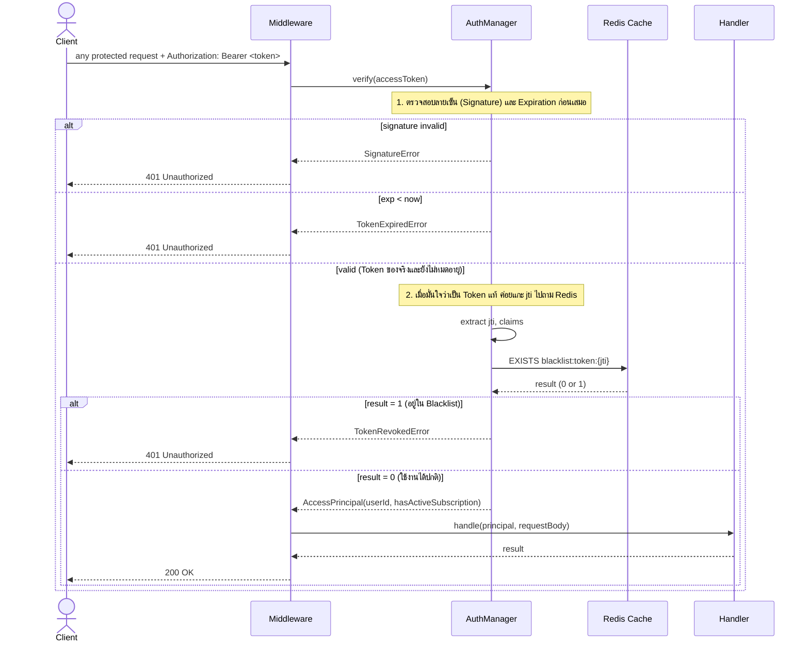
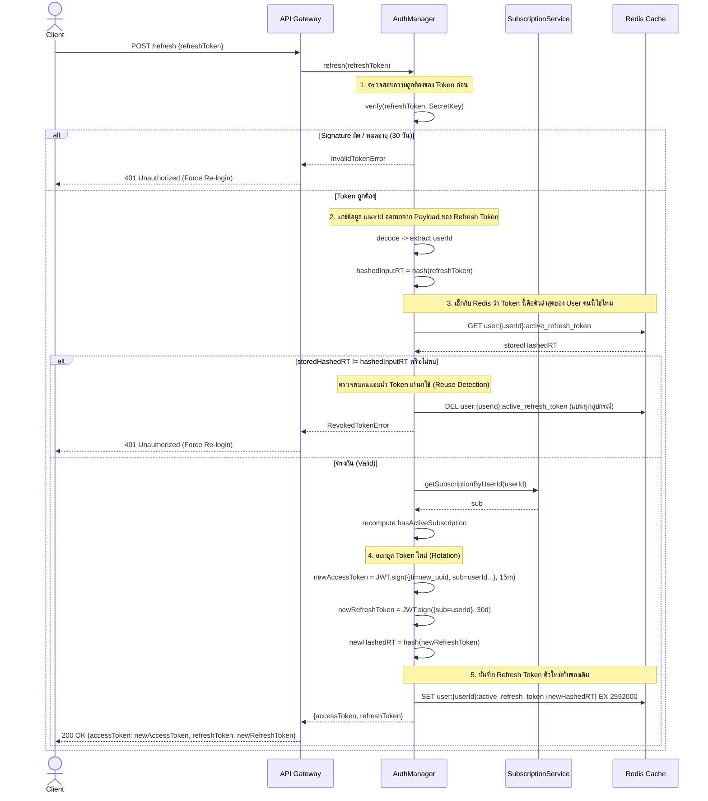
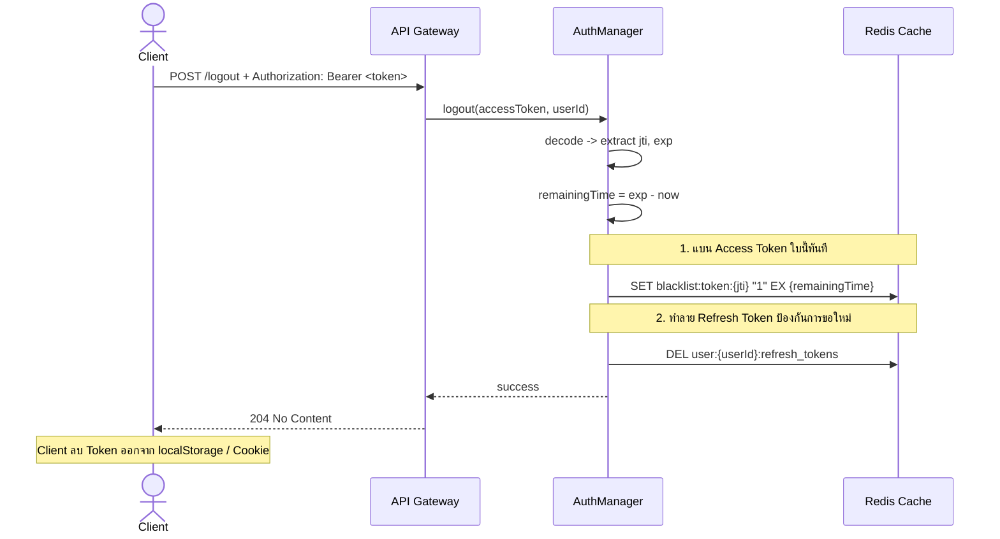

# Sequence 02 — Auth Flows (FR 2.1–2.4)

## 2.1 Login (FR 2.1, 2.2, 2.3)

## 2.2 Token Verification Middleware (FR 2.4)

## 2.3 Refresh Token (FR 2.3)

## 2.4 Logout (FR 2.1 — Client-side)

---

**หมายเหตุ**: ทุก flow ที่ตามมา (subscription, content, playback) ใช้ 2.2 เป็น step แรกเสมอ ในไดอะแกรมอื่นจะย่อเหลือ `API → AM.verify → principal`

---

# Redis Architecture for Authentication System

อธิบายโครงสร้างการจัดเก็บข้อมูลใน Redis สำหรับระบบ Hybrid Authentication (JWT + Redis) เพื่อรองรับการทำ **Instant Logout (Blacklist)** และ **Refresh Token Rotation (Reuse Detection)**

---

## 1. Access Token Blacklist

ใช้สำหรับบันทึก Access Token ที่ถูกยกเลิกการใช้งานก่อนหมดอายุ (เช่น ผู้ใช้กด Logout หรือถูกสั่งระงับสิทธิ์)

- **Key Pattern:** `blacklist:token:{jti}`
  - `{jti}`: JWT ID ซึ่งเป็น Unique ID ที่ฝังอยู่ใน Payload ของ Access Token
- **Value:** `Timestamp (Epoch Time)`
  - ตัวอย่าง: `1714476000` (เวลาที่ Token ถูกสั่ง Revoke เพื่อประโยชน์ในการทำ Audit Log)
- **TTL (Time-To-Live):** `Remaining Expiry Time` ของ Access Token ใบนั้น
  - หน่วยเป็นวินาที (Seconds)
  - **เหตุผล:** เพื่อให้ Redis ลบข้อมูลทิ้งอัตโนมัติเมื่อ Token นั้นหมดอายุตามธรรมชาติไปแล้ว ช่วยประหยัด Memory
- **การใช้งาน (Usage):**
  - **Write (SET):** ถูกสร้างเมื่อผู้ใช้เรียก API `/logout`
  - **Read (EXISTS):** ถูกตรวจสอบใน **Token Verification Middleware** (FR 2.2) ทุกครั้งที่มี Request เข้ามา โดยจะตรวจสอบ _หลังจาก_ ที่ Verify Signature ผ่านแล้วเท่านั้น เพื่อป้องกัน DoS Attack

---

## 2. Active Refresh Token (Session Management)

ใช้สำหรับตรวจสอบสิทธิ์ในการออก Access Token ใบใหม่ ป้องกันการนำ Token เก่าที่ถูกขโมยมาใช้ซ้ำ (Reuse Detection) ปัจจุบันรองรับแบบ **Single Session (1 บัญชี ล็อกอินได้ 1 อุปกรณ์)**

- **Key Pattern:** `user:{userId}:active_refresh_token`
  - `{userId}`: รหัสประจำตัวของผู้ใช้งาน
- **Value:** `Hashed Refresh Token`
  - ตัวอย่าง: `"$2b$10$EixZaYVK1fsbw1ZfbX3OXePaWxn96p36WQoeG6Lruj3vjGQx40IGN"`
  - **คำเตือน:** ห้ามเก็บ Refresh Token เป็น Plain Text เด็ดขาด ต้องผ่านฟังก์ชัน Hash (เช่น SHA-256 หรือ bcrypt) ก่อนจัดเก็บ เพื่อป้องกันกรณี Redis ถูกเจาะข้อมูล
- **TTL (Time-To-Live):** `30 Days` (2,592,000 วินาที)
  - ตั้งค่าให้เท่ากับอายุเต็มของ Refresh Token
- **การใช้งาน (Usage):**
  - **Write (SET):** ถูกอัปเดตค่าใหม่ทุกครั้งที่เรียก API `/login` (FR 2.1) หรือ `/refresh` (FR 2.3) สำเร็จ
  - **Read (GET):** ถูกเรียกอ่านตอนผู้ใช้ส่ง Refresh Token มาขอต่ออายุ (FR 2.3) เพื่อตรวจสอบว่าค่า Hash ตรงกับที่เก็บไว้หรือไม่
  - **Delete (DEL):** ถูกลบทิ้งเมื่อผู้ใช้กด `/logout` (FR 2.4) หรือเมื่อระบบตรวจพบการพยายามใช้ Refresh Token เก่าที่ถูกหมุนเวียน (Rotation) ไปแล้ว เพื่อเตะผู้ใช้ออกจากระบบทุกอุปกรณ์

---

## 💡 Security Considerations

1. **Verification Order:** ใน Middleware ต้องทำ `JWT.verify(signature)` ก่อนนำ `jti` ไปคิวรีลง Redis เสมอ
2. **Reuse Detection:** หากผู้ใช้ส่ง Refresh Token มา แต่ Hash ไม่ตรงกับใน `active_refresh_token` ให้สันนิษฐานว่า Token รั่วไหล ต้องสั่ง `DEL user:{userId}:active_refresh_token` ทันที
