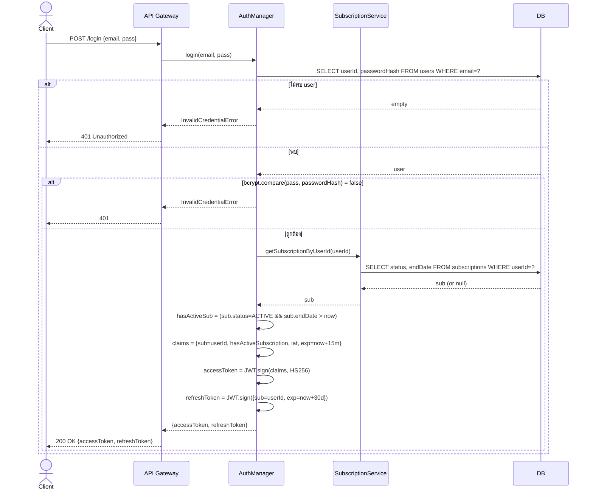
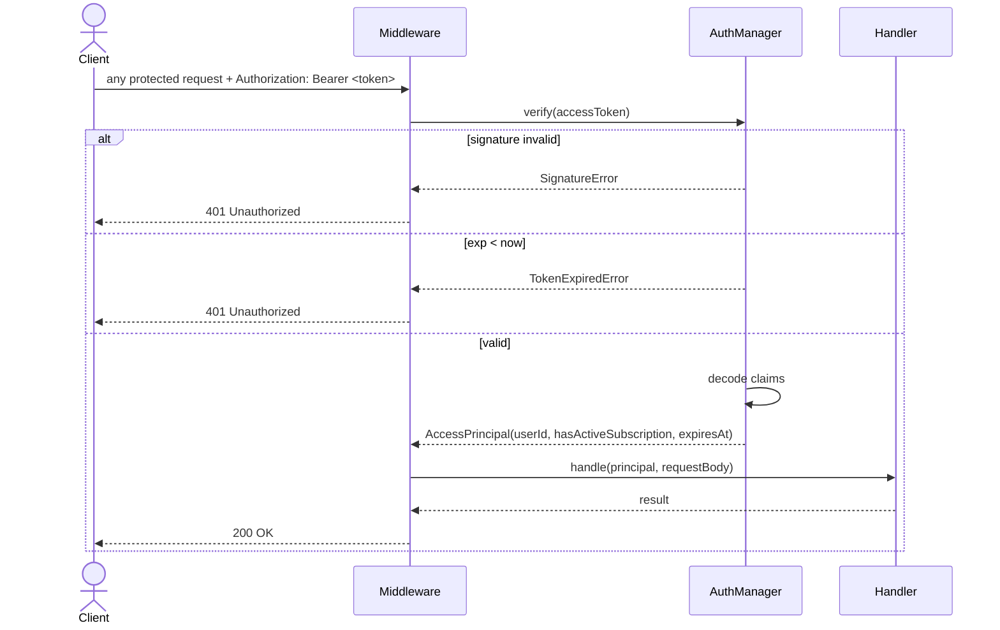
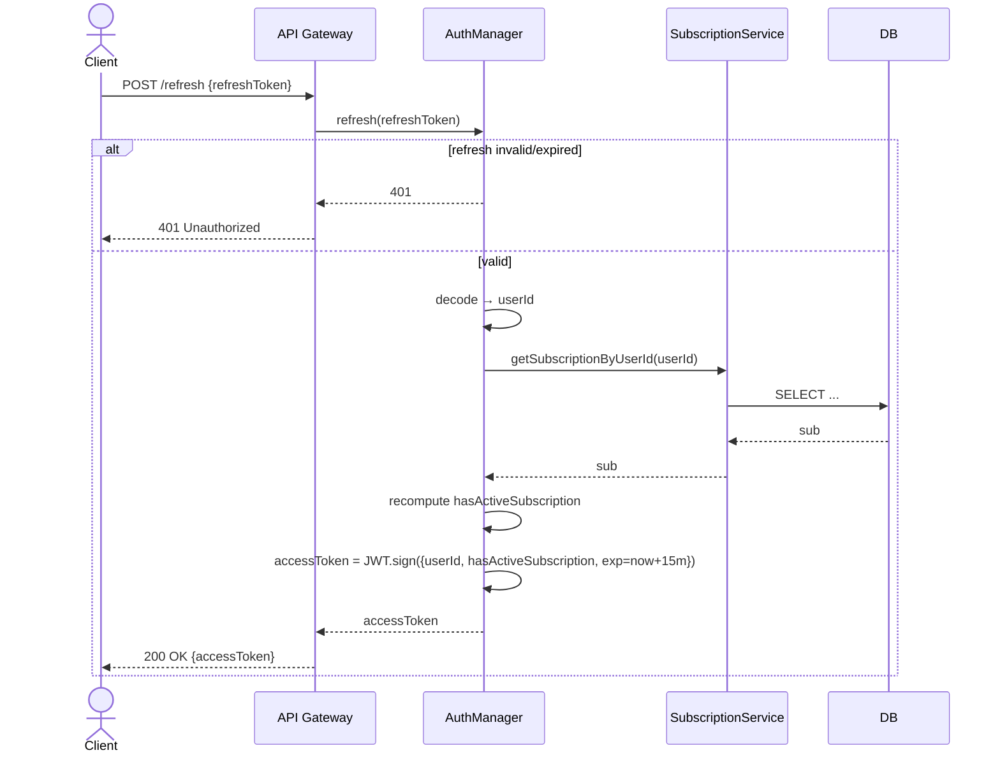
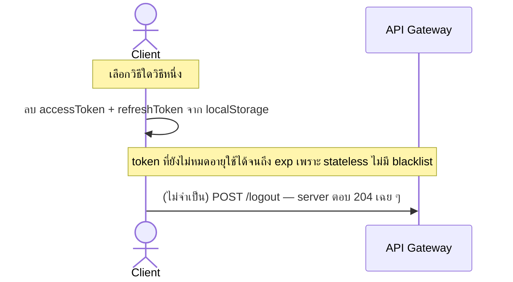

# Sequence 02 — Auth Flows (FR 2.1–2.4)

## 2.1 Login (FR 2.1, 2.2, 2.3)

## 2.2 Token Verification Middleware (FR 2.4)

## 2.3 Refresh Token (FR 2.3)

## 2.4 Logout (FR 2.1 — Client-side)

---

**หมายเหตุ**: ทุก flow ที่ตามมา (subscription, content, playback) ใช้ 2.2 เป็น step แรกเสมอ ในไดอะแกรมอื่นจะย่อเหลือ `API → AM.verify → principal`
