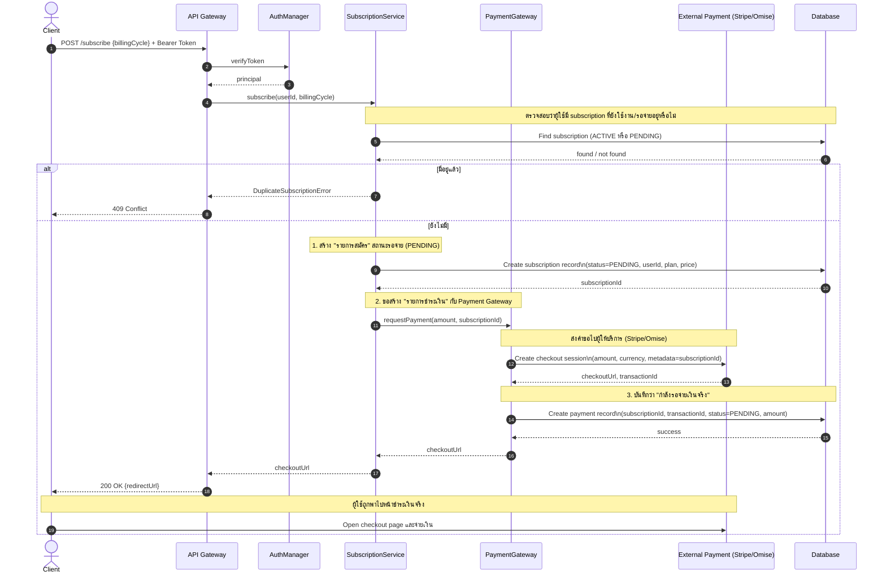
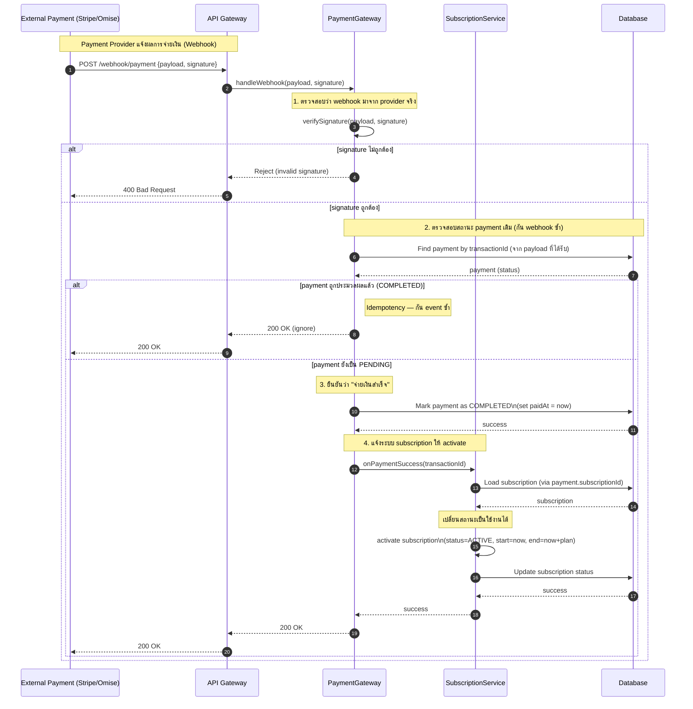
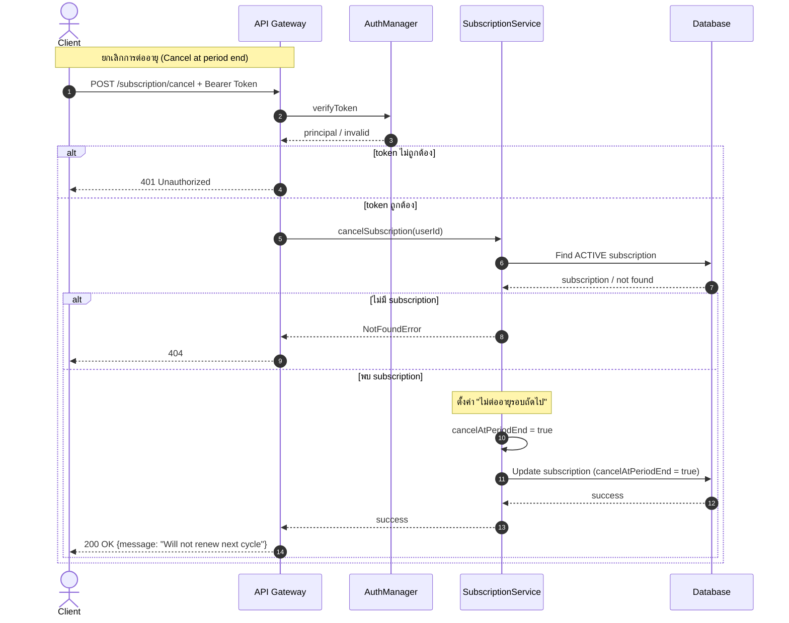
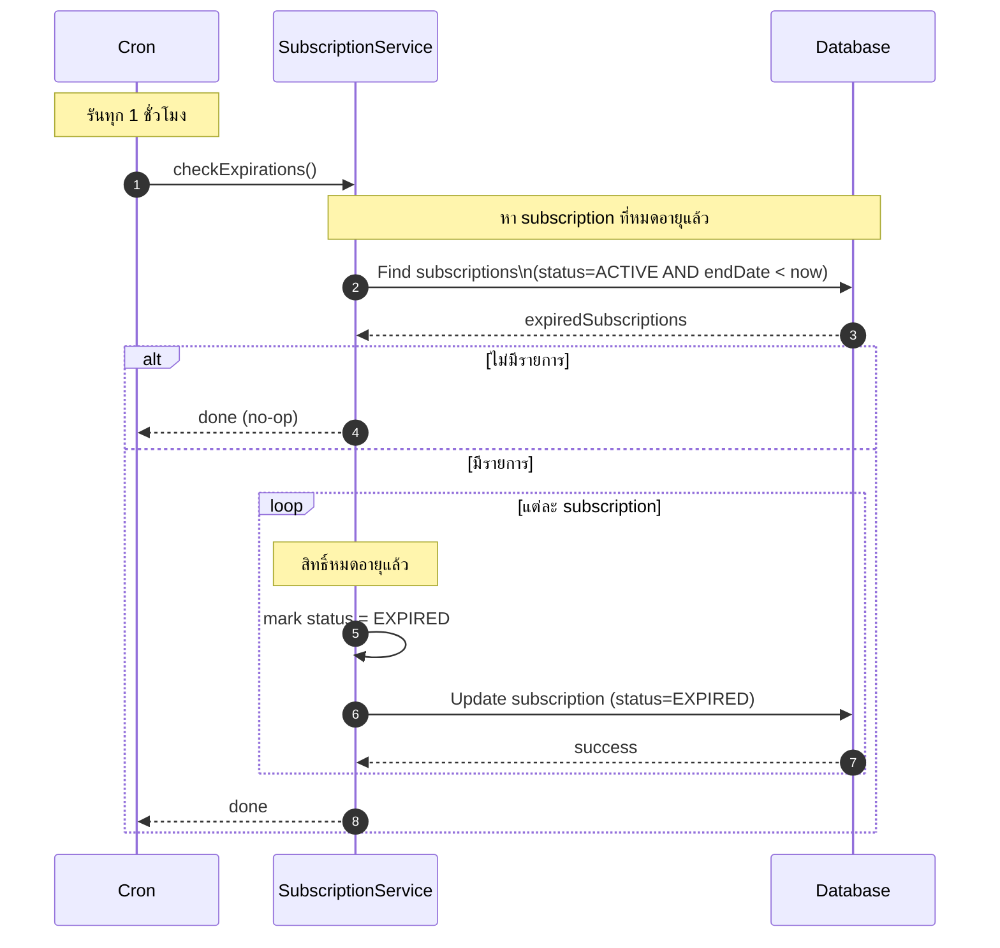
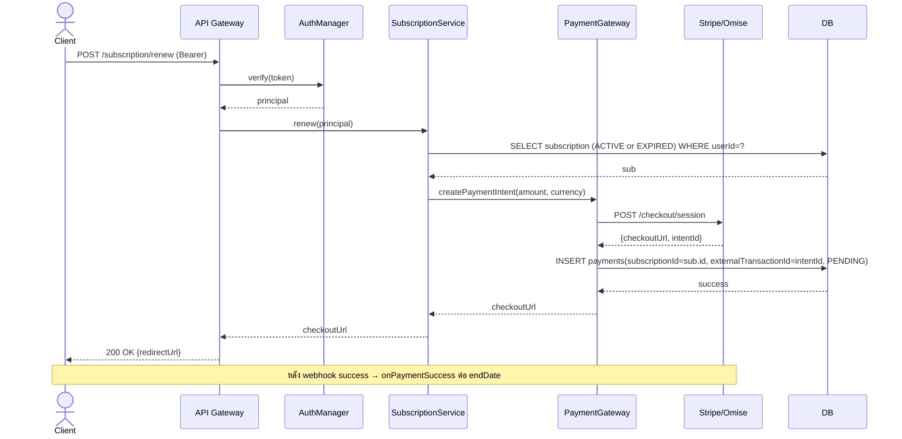

# Sequence 03 — Subscription + Payment Flows (FR 3.1–3.4, FR 4.1–4.2)

## 3.1 Subscribe + Initiate Payment (FR 3.1, FR 4.1)

## 3.2 Payment Webhook → Activate Subscription (FR 3.4, FR 4.2)

## 3.3 Cancel Subscription (FR 3.1)

## 3.4 Subscription Expiration Check (FR 3.3 — Scheduled)

## 3.5 Renew Subscription

