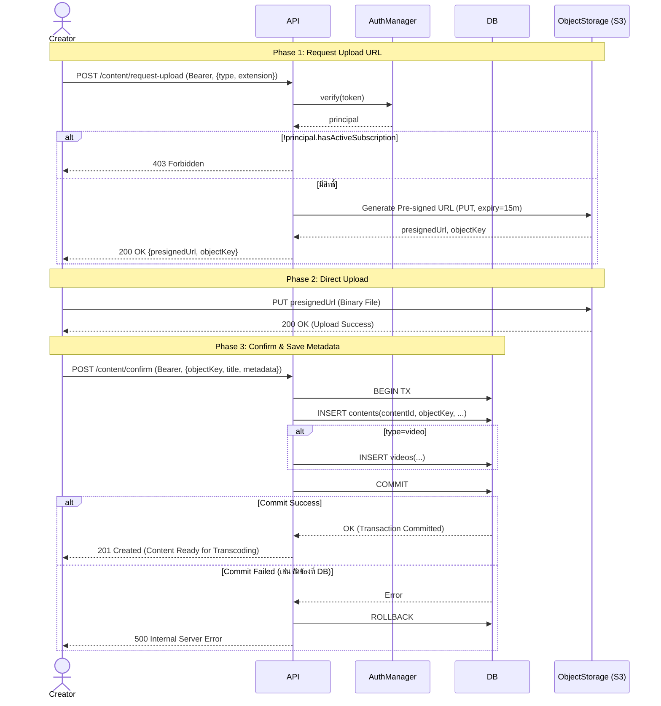
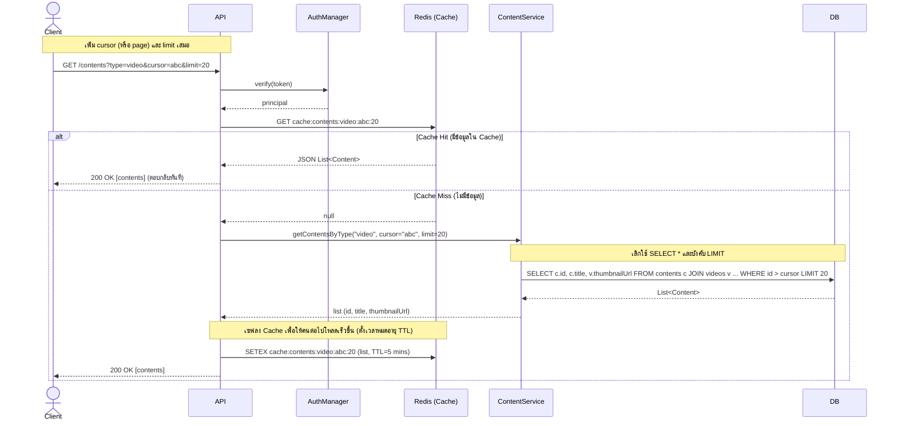
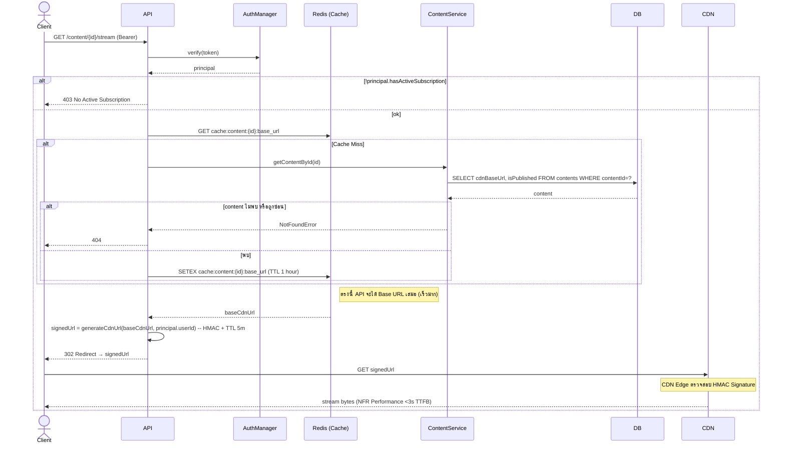
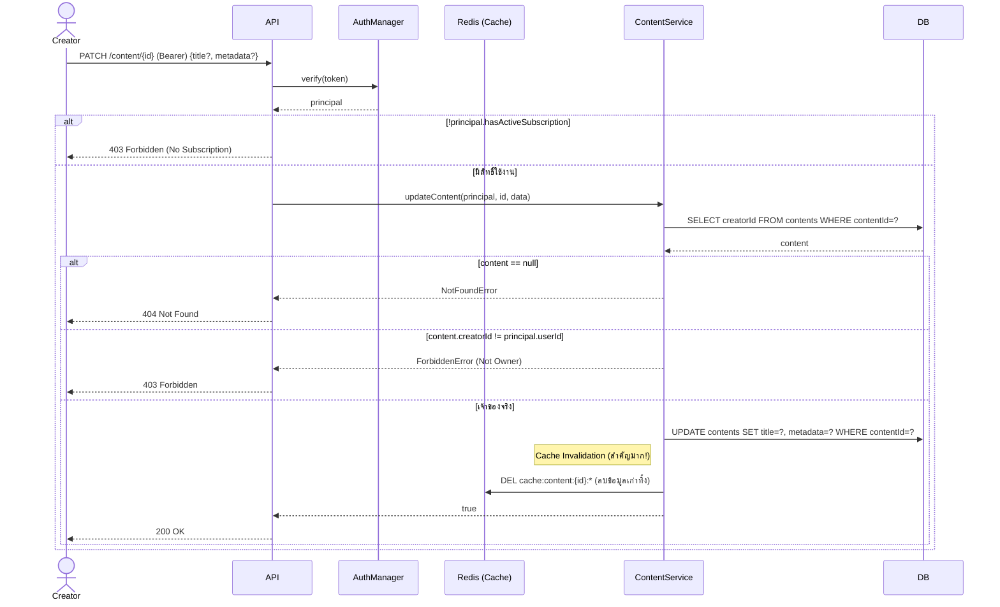
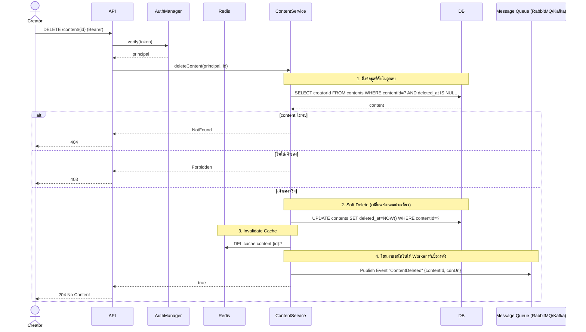
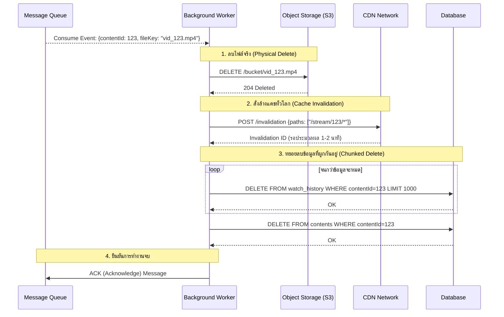

# Sequence 04 — Content Flows (FR 5.1, 5.2, 5.3)

## 4.1 Upload Content (FR 5.1)

## 4.2 List Contents (FR 5.2)

## 4.3 Stream Content with Subscription Check (FR 5.3)

## 4.4 Update Own Content (FR 5.1)

## 4.5 Delete Own Content

## 4.6 Delete Content Using Message Queue In Background

