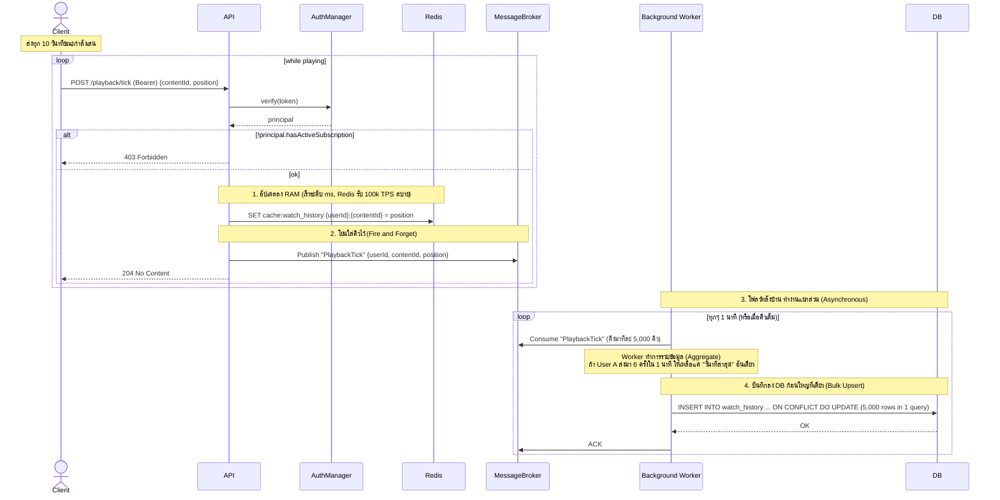
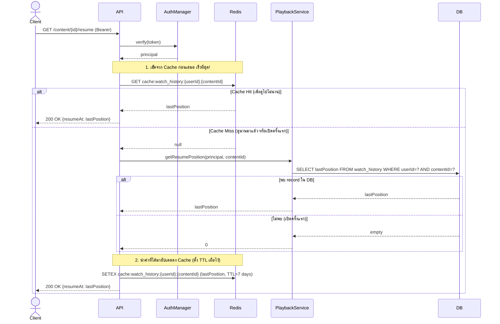
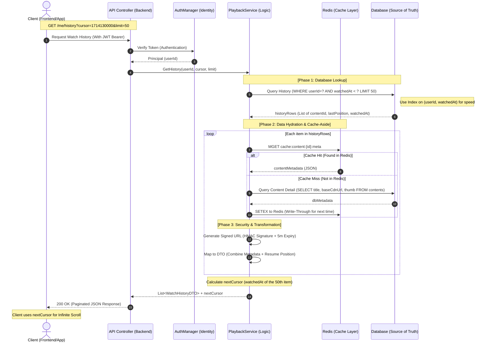
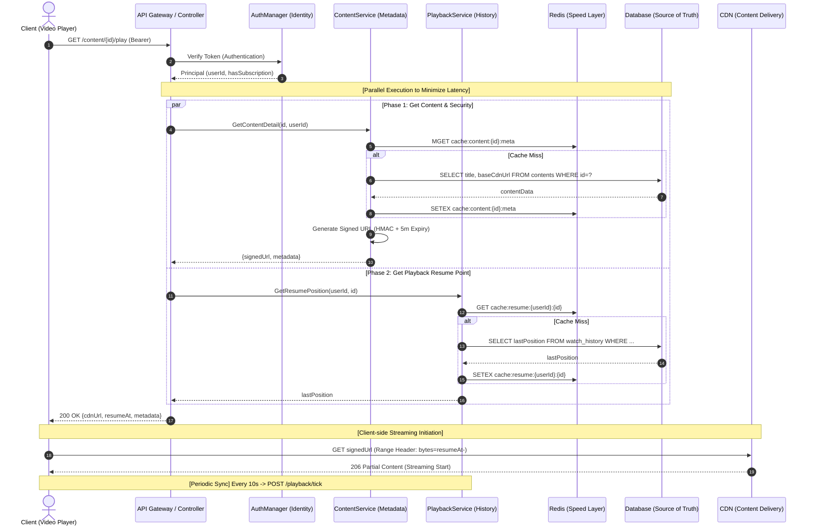

# Sequence 05 — Playback & Watch History (FR 5.4)

## 5.1 Record Watch Position (heartbeat ขณะเล่น)

## 5.2 Resume Playback เมื่อเปิด content ค้างไว้ (FR 5.4)

## 5.3 View Watch History

## 5.4 Combined — Open Content → Resume → Record

