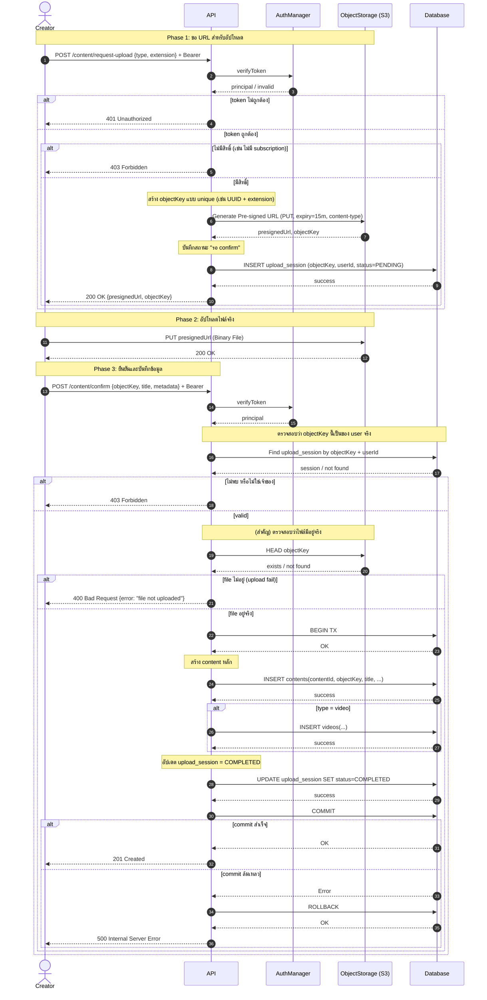
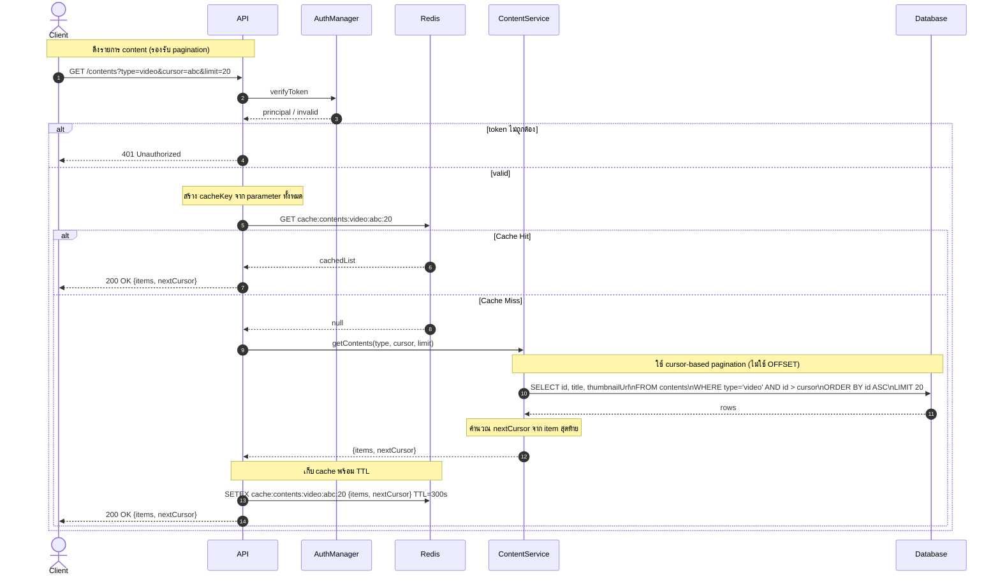
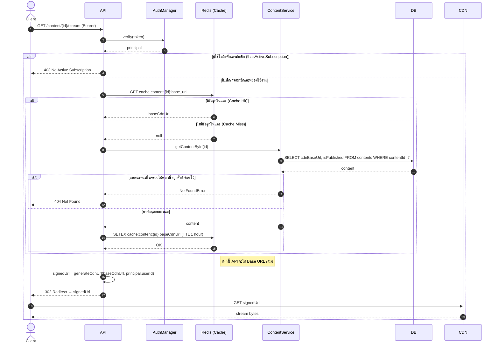
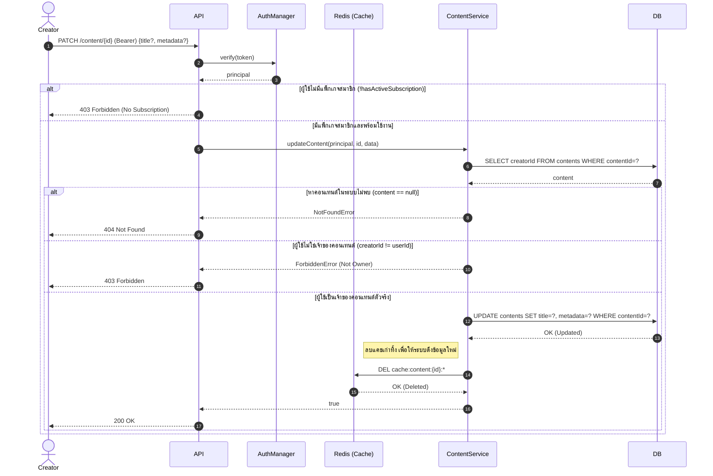
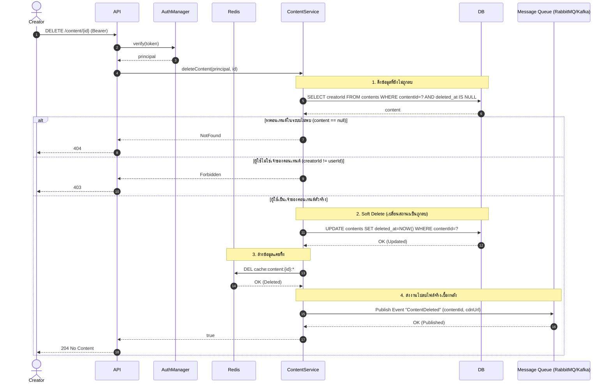
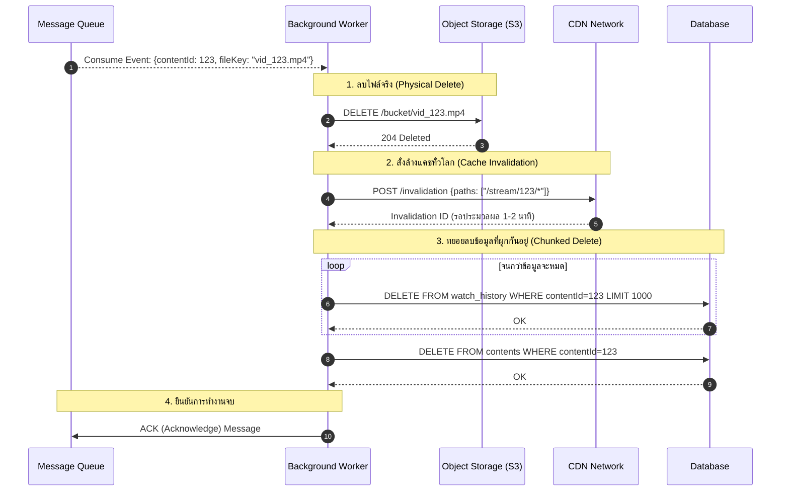

# Sequence 04 — Content Flows (FR 5.1, 5.2, 5.3)

## 4.1 Upload Content (FR 5.1)

## 4.2 List Contents (FR 5.2)

## 4.3 Stream Content with Subscription Check (FR 5.3)

## 4.4 Update Own Content (FR 5.1)

## 4.5 Delete Own Content

## 4.6 Delete Content Using Message Queue In Background

---

# Redis Architecture for Content System

อธิบายโครงสร้างการจัดเก็บข้อมูลใน Redis สำหรับระบบ Video Streaming ในส่วนของ **Content (Read-Heavy)** เพื่อลดความซ้ำซ้อนของข้อมูล จัดการหน่วยความจำได้อย่างมีประสิทธิภาพ และรองรับการทำ Pagination หน้า Feed อย่างถูกต้อง

---

## 1. Content Metadata (Read-Heavy)

ใช้สำหรับเก็บรายละเอียดของ Content เพื่อลดการ Query Database โดยตรง ข้อมูลนี้จะถูกเรียกใช้ทั้งในหน้า Detail ของวิดีโอ และใช้ดึงข้อมูลประกอบหน้า Feed

- **Key Pattern:** `cache:content:{id}:meta`
  - `{id}`: รหัสประจำตัวของวิดีโอ (Content ID)
- **Value:** `JSON String` (หรือ `Hash`)
  - ตัวอย่าง: `{"title": "...", "baseCdnUrl": "...", "thumbnail": "...", "isPublished": true}`
- **TTL (Time-To-Live):** `1 Hour` (3,600 วินาที)
  - **เหตุผล:** เป็นระยะเวลาที่เหมาะสมสำหรับข้อมูลที่ไม่ได้เปลี่ยนบ่อย ช่วยลดโหลด DB ได้ดี และไม่เก็บนานเกินไปจนข้อมูลล้าหลัง
- **การใช้งาน (Usage):**
  - **Write (SETEX):** ถูกอัปเดตเมื่อมีผู้ใช้เรียกดู Content นั้นเป็นครั้งแรก (Cache Miss แล้วไปดึงจาก DB มาวาง)
  - **Read (GET/MGET):** ถูกอ่านเมื่อเปิดหน้าวิดีโอ หรือใช้ `MGET` ดึงพร้อมกันหลายๆ วิดีโอเพื่อประกอบร่างหน้า Feed
  - **Delete (DEL):** ระบบหลังบ้าน (CMS) ต้องสั่งลบหรืออัปเดตค่านี้ทันที (Cache Invalidation) เมื่อมีการแก้ไขข้อมูล เช่น เปลี่ยนภาพปก หรือสั่ง Unpublish

---

## 2. Content List Cache / Feed (Pagination Management)

ใช้เก็บรายการ Content ตามหมวดหมู่ สำหรับหน้า Feed หรือระบบ Infinite Scroll โดยปรับมาใช้ Sorted Set เพื่อแก้ปัญหาข้อมูลซ้ำซ้อนและป้องกันปัญหา Pagination Shift (ข้อมูลเคลื่อนเวลาเลื่อนหน้าจอ)

- **Key Pattern:** `cache:feed:{type}`
  - `{type}`: ประเภทของ Feed เช่น `trending`, `new_releases`, `action_movies`
- **Value:** `Sorted Set (ZSET)`
  - **Score:** `Timestamp (Epoch Time)` ใช้เวลาที่เพิ่มวิดีโอเข้าหมวดหมู่นั้น เพื่อใช้ในการเรียงลำดับ
  - **Member:** `{contentId}` (เก็บแค่ ID เท่านั้น)
- **TTL (Time-To-Live):** `5 - 15 Minutes`
  - **เหตุผล:** เพื่อให้หน้า Feed มีความสดใหม่เสมอ อัปเดตเทรนด์ได้ทันสถานการณ์
- **การใช้งาน (Usage):**
  - **Write (ZADD):** ถูกสร้างและเติมข้อมูลโดย Background Job หรือเมื่อมีคนเปิดดู Feed หมวดนั้นแล้ว Cache Miss
  - **Read (ZREVRANGEBYSCORE):** ใช้ดึง `{contentId}` ออกมาทีละชุด (เช่น ครั้งละ 20 รายการ) ตามช่วง Timestamp ของ Cursor จากนั้น API จะนำ Array ของ ID ที่ได้ ไปทำ `MGET` จากข้อ 1 เพื่อประกอบข้อมูลส่งให้ Client

---

## 💡 Architecture & Performance Considerations

1. **Normalization in Cache:** การออกแบบให้ Feed (ข้อ 2) เก็บเฉพาะ ID แล้วค่อยไป `MGET` กับ Metadata (ข้อ 1) ช่วยประหยัด RAM มหาศาล และเมื่อแอดมินเปลี่ยนภาพปกวิดีโอ หน้า Feed ทุกหมวดหมู่จะเห็นภาพปกใหม่ทันทีโดยไม่ต้องไปตามลบ Cache Feed ทีละอัน
