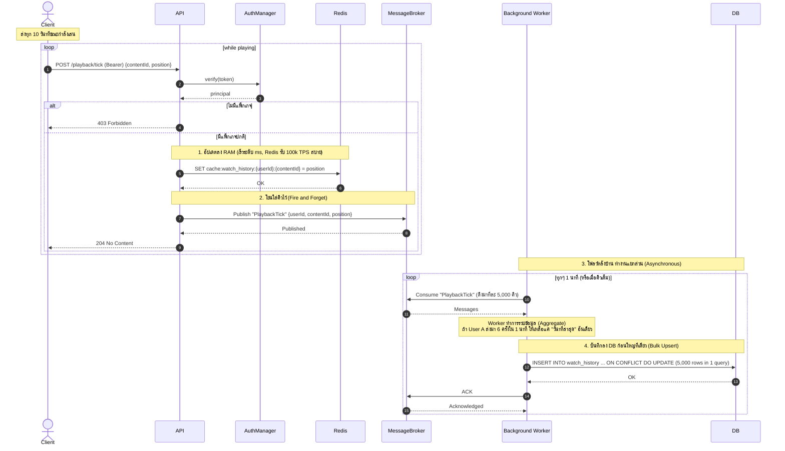
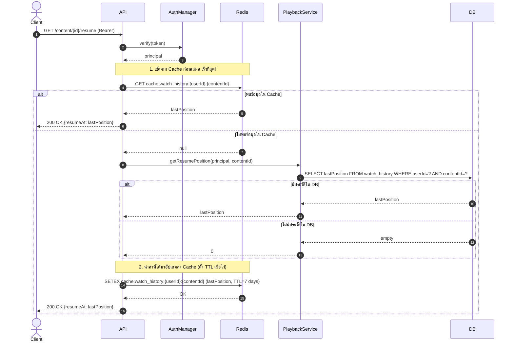
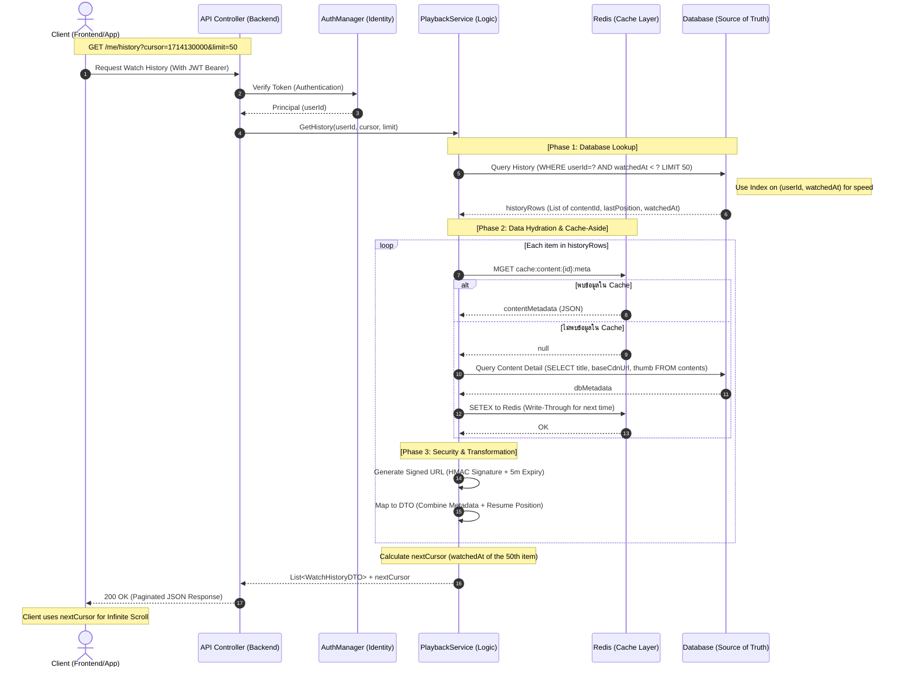
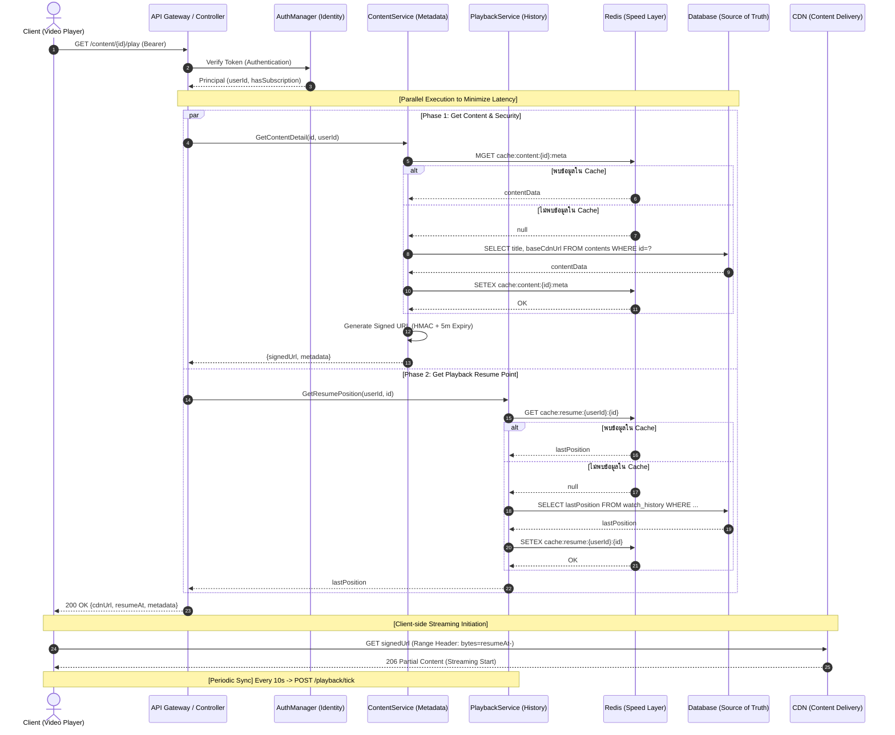

# Sequence 05 — Playback & Watch History (FR 5.4)

## 5.1 Record Watch Position (heartbeat ขณะเล่น)

## 5.2 Resume Playback เมื่อเปิด content ค้างไว้ (FR 5.4)

## 5.3 View Watch History

## 5.4 Combined — Open Content → Resume → Record

---

# Redis Architecture for Playback System

อธิบายโครงสร้างการจัดเก็บข้อมูลใน Redis สำหรับระบบ Video Streaming ในส่วนของ **Playback (Write-Heavy)** ซึ่งออกแบบมาเพื่อรับโหลดมหาศาลจากการส่งข้อมูลสถานะการเล่น (Heartbeat) ของผู้ใช้งานพร้อมกันจำนวนมาก โดยไม่ทำให้ Database หลักล่ม

---

## 1. Watch History & Resume State (Write-Heavy)

ใช้บันทึกตำแหน่งการเล่นล่าสุดของผู้ใช้ (Resume Playback) โดยอาศัย Redis เป็นด่านหน้าในการรับ Write Load เนื่องจากพฤติกรรมการเล่นวิดีโอจะมีการยิง API เข้ามาอัปเดตข้อมูลถี่มาก (High Write TPS)

- **Key Pattern:** `cache:watch_history:{userId}:{contentId}`
  - `{userId}`: รหัสประจำตัวของผู้ใช้งาน
  - `{contentId}`: รหัสประจำตัวของวิดีโอที่กำลังดู
- **Value:** `Integer`
  - ตัวอย่าง: `1250` (วินาทีล่าสุดที่ดูค้างไว้)
- **TTL (Time-To-Live):** `7 Days` (604,800 วินาที)
  - **เหตุผล:** ครอบคลุมพฤติกรรมผู้ใช้ส่วนใหญ่ที่มักจะกลับมาดูวิดีโอเดิมต่อภายในไม่กี่วัน การตั้ง TTL จะช่วยป้องกันไม่ให้ Memory ของ Redis เต็มจากประวัติการดูเก่าๆ ที่ผู้ใช้ดูจบไปนานแล้ว
- **การใช้งาน (Usage):**
  - **Write (SET):** ถูกอัปเดตอย่างต่อเนื่อง (เช่น ทุกๆ 10 วินาที) ขณะที่วิดีโอกำลังเล่นบนฝั่ง Client
  - **Read (GET):** ถูกเรียกอ่านเมื่อผู้ใช้เปิดวิดีโอขึ้นมาใหม่ เพื่อหาจุดเริ่มเล่นต่อ (หาก Cache Miss หรือข้อมูลถูกลบไปแล้ว ถึงจะ Fallback ไปคิวรีหาใน DB หลัก)

---

## 💡 Architecture & Performance Considerations

1. **Asynchronous DB Sync (Write-Behind Pattern):** ข้อมูลตำแหน่งการเล่นที่เขียนลง Redis เป็นเพียงจุดพักชั่วคราวเพื่อให้ตอบสนองเร็ว ระบบต้อง Publish ข้อมูลนี้ลง Message Queue (เช่น RabbitMQ หรือ Kafka) ด้วย เพื่อให้ Background Worker ทยอยนำข้อมูลไปรวบรวม (Aggregate) แล้วทำ Bulk Upsert ลง Database ก้อนใหญ่ทีเดียว **(ห้ามเขียนลง DB โดยตรงทุกๆ 10 วินาทีเด็ดขาด)**
2. **Eviction Policy:** ควรตั้งค่า Redis Server สำหรับ Server ที่จัดการ Playback เป็น `volatile-lru` เสมอ เพื่อเป็นตาข่ายนิรภัย หาก Memory กำลังจะเต็ม ระบบจะได้เลือกลบ Key ประวัติการดูเก่าๆ ที่มี TTL ทิ้งไปก่อน โดยไม่กระทบกับคนที่กำลังดูวิดีโออยู่ ณ วินาทีนั้น
